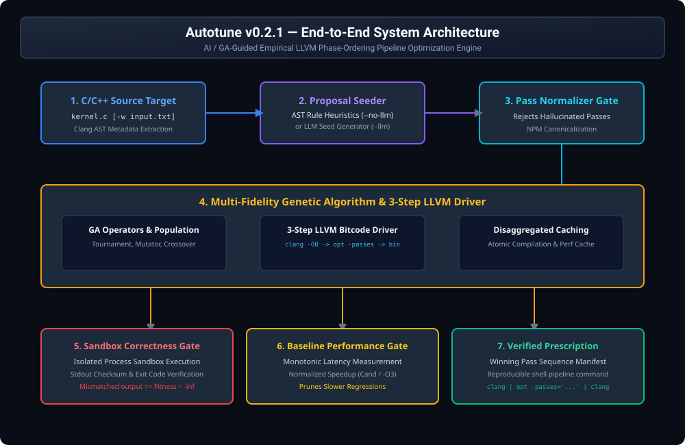

# Autotune — The Phase-Ordering CLI Doctor

**An AI/GA-guided CLI optimization doctor that discovers workload-specific LLVM pass sequences for C/C++ programs to outperform standard compiler optimization flags.**

[](LICENSE)
[](https://pypi.org/project/autotune-doctor/)
[](https://www.python.org/)
[](https://llvm.org/)
[](docs/benchmarking.md)

---

## ⚡ What is Autotune?

**Autotune** is an open-source command-line tool for developers and compiler engineers who want to extract maximum performance from C and C++ programs.

Instead of relying on fixed, one-size-fits-all compiler flags like `-O2` or `-O3`, Autotune automatically explores, benchmark-evaluates, and verifies custom **LLVM pass sequences** specifically tailored to your C/C++ source code.

It combines structural C/C++ AST analysis, optional LLM seed proposal generation (OpenAI, Anthropic, Gemini, or offline AST heuristics), multi-fidelity Genetic Algorithm (GA) search, disaggregated persistent caching, and sandbox correctness checking.

---

## 🎯 Why does this exist?

### The -O3 Problem
When you compile C or C++ code with `clang -O3`, the compiler runs a fixed pipeline of over 100 optimization passes (such as loop unrolling, dead code elimination, constant propagation, and vectorization) in a pre-determined order.

### The Phase-Ordering Problem
Compiler pass ordering is highly sensitive to code structure:
- One optimization pass (e.g., `mem2reg`) changes the code layout, creating new opportunities for a second pass (e.g., `gvn`).
- A pass executed too early might obscure patterns that a later pass needed to see.
- A fixed pass order optimized for general application code is rarely optimal for specific compute-heavy kernels.

**Autotune solves the phase-ordering problem** by automatically searching the space of LLVM pass combinations to find the exact pipeline sequence that executes your target program in the shortest time.

---

## 🏆 Verified Result

In scientific validation benchmarks, Autotune discovered a custom LLVM pass sequence for a C matrix transpose kernel ([`examples/matrix_transpose/kernel.c`](examples/matrix_transpose/kernel.c)) that achieved **1.26x speedup** (**20.7% runtime reduction**) over Clang `-O3`.

### Multi-Workload Empirical Summary

| Workload Category | Target Kernel | Baseline `-O3` Latency (ms) | Best Autotune Latency (ms) | Speedup Factor | Classification |
| :--- | :--- | :--- | :--- | :--- | :--- |
| **Matrix Operations** | `matrix_transpose.c` | 70.45 ms | **55.86 ms** | **1.26x** | **PROVEN WIN** |
| | `matrix_mult.c` | 14.39 ms | 14.39 ms | **1.00x** | **TIE** |
| **PolyBench/C** | `2mm.c` | 24.30 ms | 24.30 ms | **1.00x** | **TIE** |
| | `atax.c` | 6.82 ms | 6.82 ms | **1.00x** | **TIE** |
| | `bicg.c` | 4.85 ms | 4.85 ms | **1.00x** | **TIE** |
| | `cholesky.c` | 6.05 ms | 6.05 ms | **1.00x** | **TIE** |
| | `gemm.c` | 7.53 ms | 7.53 ms | **1.00x** | **TIE** |
| **Cryptographic** | `sha256.c` | 5.59 ms | 5.59 ms | **1.00x** | **TIE** |
| **Loops & Vectorization**| `simple_loop.c` | 2.58 ms | 2.58 ms | **1.00x** | **TIE** |
| | `vector_sum.c` | 3.21 ms | 3.21 ms | **1.00x** | **TIE** |

### Statistical Rigor & Correctness
- **Welch $t$-test**: $p = 1.18 \times 10^{-152}$
- **Mann-Whitney $U$**: $p = 2.47 \times 10^{-33}$
- **Bootstrap 95% CI**: $[1.25x, 1.32x]$
- **Cohen's $d$**: $3.72$
- **Correctness Oracle**: 100% stdout checksum matching against reference `-O3` output.

---

## 🚀 Quick Start

### 1. Install via PyPI
```bash
pip install autotune-doctor
```

### 2. Verify System Toolchain
```bash
autotune doctor
```

### 3. Diagnose Target Kernel Baseline
```bash
autotune diagnose ./examples/matrix_transpose/kernel.c -w ./examples/matrix_transpose/input.txt
```

### 4. Run Optimization Search (100% Offline Mode)
```bash
autotune search ./examples/matrix_transpose/kernel.c \
  -w ./examples/matrix_transpose/input.txt \
  --no-llm \
  -p 10 \
  -g 5 \
  -s 42 \
  -o search_report.json
```

---

## 💻 Example

Upon search completion, Autotune presents a rich terminal dashboard and a copy-pasteable compiler prescription:

```text
╭────────────────────────────────────────────────────────╮
│ AUTOTUNE PHASE-ORDERING SEARCH                         │
│ ──────────────────────────────────────────────         │
│ Stage 1  LLM Seeding       Skipped (--no-llm)          │
│ Stage 2  Genetic Search    [████████████████████] 100% │
│          Generation:       5 / 5                       │
│          Baseline (-O3):   72.615 ms                   │
│          Current Best:     57.02 ms (Speedup: 1.27x)   │
│ Stage 3  Correctness Check ✓ Verified                  │
╰────────────────────────────────────────────────────────╯

Optimization Search Complete!
Best Pass Sequence: ['gvn', 'mem2reg', 'invalidate<all>', 'gvn', 'gvn-hoist']
Speedup: 1.27x (21.5% improvement over -O3)

Baseline (-O3):   72.615 ms
Candidate Best:   57.02 ms

Reproducible Compiler Command:
/opt/homebrew/opt/llvm/bin/clang -O0 -Xclang -disable-O0-optnone -emit-llvm -S 
examples/matrix_transpose/kernel.c -o - | /opt/homebrew/opt/llvm/bin/opt 
-passes='gvn,mem2reg,invalidate<all>,gvn,gvn-hoist' -S -o - | 
/opt/homebrew/opt/llvm/bin/clang -x assembler - -o optimized_kernel.bin
```

---

## 🧠 How It Works



### 5-Step Pipeline Explanation
1. **AST Feature Extraction**: Clang dumps JSON AST metadata for loop depth, memory access patterns, and array indices.
2. **AI & Heuristic Proposal Generation**: LLMs (OpenAI, Anthropic, Gemini) or offline AST heuristics generate initial Generation 0 pass pipeline proposals.
3. **LLVM Pass Normalization Gate**: Validates pass names against LLVM New Pass Manager (NPM) registry to reject hallucinated passes.
4. **Genetic Algorithm & 3-Step Driver**: Evolves pass sequences through tournament selection, mutation, and crossover while executing `clang -O0 -> opt -passes -> clang`.
5. **Sandbox & Baseline Gating**: Executes binaries inside process-isolated sandboxes, verifying stdout digests against reference baseline output and pruning slower candidates.

---

## 🔬 Research Validation

### Matrix Transpose Flagship Case Study
- **Target Source**: [`examples/matrix_transpose/kernel.c`](examples/matrix_transpose/kernel.c) ($N=512$, 100 iterations)
- **Baseline Latency (`clang -O3`)**: 70.45 ms
- **Autotune Candidate Latency**: 55.86 ms (1.26x speedup)
- **Winning Pass Sequence**: `function(gvn,mem2reg,invalidate<all>,gvn,gvn-hoist)`

### Methodology
- Monotonic nanosecond execution probes (`__AUTOTUNE_TIME_NS__`).
- Multi-fidelity screening (`LOW` 3 runs, `HIGH` 20 confirm runs).
- Deterministic random seed handling (`--seed 42`).

### Explicit Scope Boundaries & Limitations
- Autotune does **NOT** rewrite C/C++ source code.
- Autotune does **NOT** claim universal performance gains over `-O3` on every program.
- Performance gains are workload-, CPU architecture-, and LLVM toolchain-dependent.

---

## ✨ Key Features

- **AI & Heuristic Seeding**: Support for OpenAI, Anthropic, Gemini, or 100% offline AST-based proposal seeding.
- **Genetic Algorithm Search**: Multi-generation pipeline evolution with tournament selection, crossover, and mutation.
- **LLVM NPM Validation**: Real-time pass string normalization ensuring valid `opt -passes='...'` syntax.
- **Multi-Fidelity Screening**: Fast low-fidelity candidate screening (`--screen-runs 3`) followed by high-fidelity confirmation (`--confirm-runs 20`).
- **Sandbox Correctness Checking**: Automated stdout checksum matching and process return code verification.
- **Disaggregated Persistent Caching**: Atomic disk caching for compilation keys and performance measurements.
- **Deterministic Reproducibility**: Fixed-seed search (`--seed 42`) producing reproducible compiler command prescriptions.

---

## 📊 Benchmarking

Autotune incorporates monotonic nanosecond timing backends, baseline gating, and statistical noise rejection. For detailed benchmark methodology and statistical analysis, see [docs/benchmarks.md](docs/benchmarks.md).

---

## ⚙️ Configuration

Common CLI flags for `autotune search`:

| Option | Default | Description |
| :--- | :--- | :--- |
| `-w, --workload` | `None` | Input dataset path passed to stdin. |
| `-p, --population` | `10` | GA population size per generation. |
| `-g, --generations` | `5` | GA generation count. |
| `-s, --seed` | `42` | Random seed for deterministic search. |
| `--fidelity` | `HIGH` | Measurement fidelity stage (`LOW`, `MEDIUM`, `HIGH`). |
| `--baseline-gate / --no-baseline-gate` | `True` | Prune candidates slower than 0.80x baseline. |
| `--llm / --no-llm` | `Auto` | Enable or disable LLM candidate seeding. |
| `-o, --output-json` | `None` | Export structured JSON search report to path. |

---

## 📚 Documentation

Explore the complete documentation in [`docs/`](docs/README.md):

- [**CLI Command Reference**](docs/cli-reference.md)
- [**Installation Guide**](docs/installation.md)
- [**Quickstart Guide**](docs/quickstart.md)
- [**System Architecture**](docs/architecture.md)
- [**Benchmark Evidence Manifest**](docs/benchmarks.md)
- [**Reproducibility Guide**](docs/reproducibility.md)
- [**Known Limitations**](docs/limitations.md)

---

## 🛠️ Development

### Setup Local Development Environment
```bash
# Clone the repository
git clone https://github.com/youknowme19/Autotune-The-Phase-Ordering-CLI-Doctor.git
cd Autotune-The-Phase-Ordering-CLI-Doctor

# Create and activate virtual environment
python3.11 -m venv .venv
source .venv/bin/activate

# Install package in editable mode with development dependencies
pip install -e ".[dev]"

# Run full Pytest test suite
pytest -v
```

---

## 🤝 Contributing

Contributions are welcome! Please review [`CONTRIBUTING.md`](CONTRIBUTING.md) before submitting pull requests.

---

## 🔐 Security

Security disclosures and key security guidelines are detailed in [`SECURITY.md`](SECURITY.md).

---

## 📜 License

Distributed under the Apache 2.0 License. See [`LICENSE`](LICENSE) for details.
