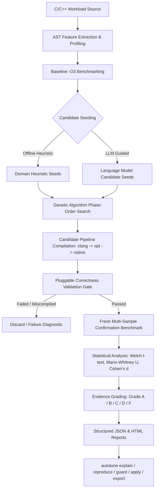

# Autotune — The LLVM Phase-Ordering CLI Doctor

**A production-grade, AI-guided compiler optimization and diagnostics system that systematically searches, verifies, and proves workload-specific LLVM pass pipelines for C/C++ workloads to outperform standard `-O3`.**

[](LICENSE)
[](https://pypi.org/project/autotune-doctor/)
[](https://www.python.org/)
[](https://llvm.org/)
[](docs/benchmarking.md)

---

## ⚡ Core Product Philosophy

Autotune transforms compiler optimization from manual guesswork into a reproducible, developer-usable science:

1. **Analyze Workload**: Extract AST loop depths, memory intensity, branch density, and floating-point operations.
2. **Empirical Baseline**: Benchmark the standard `clang -O3` pipeline across isolated warmup and timed runs.
3. **Generate Candidates**: Seed candidate pass pipelines via LLM or deterministic AST heuristics (**100% functional offline**).
4. **Search Space**: Evolve pass sequences using Genetic Algorithms and multi-armed bandit heuristics.
5. **Strict Correctness**: Verify candidate execution against baseline using pluggable validation strategies.
6. **Statistically Verify**: Calculate Welch's t-test, Mann-Whitney U tests, Cohen's d effect size, and Evidence Grades.
7. **Explain Mechanics**: Deconstruct observed speedups into *Observed Facts*, *Inferred Mechanics*, and *Hypothesized Effects*.
8. **Reproduce & Guard**: Validate speedup stability across environments and enforce CI regression gates.
9. **Export & Apply**: Generate production compiler artifacts (`.ll`, `.optimized.ll`, `.s`, native binary, CMake, Make, and Shell scripts) without altering user source code.

> [!IMPORTANT]
> **The LLM is NEVER the final authority.** In Autotune, AI suggestions are treated as unverified candidate hypotheses. Only empirical execution, rigorous correctness validation, and statistical proof determine whether an optimization candidate is accepted.

---

## 🔬 System Workflow Architecture



---

## 🚀 Quick Start

### 1. Installation

```bash
pip install autotune-doctor
# Or install in editable developer mode:
git clone https://github.com/youknowme19/Autotune-The-Phase-Ordering-CLI-Doctor.git
cd Autotune-The-Phase-Ordering-CLI-Doctor
pip install -e .
```

### 2. Verify Toolchain

```bash
autotune doctor
```

### 3. Optimize a Workload (Flagship Command)

```bash
autotune doctor examples/matrix_transpose/kernel.c --preset quick
```

Output:
```text
╭──────────────────────────────────────────────────────────╮
│ AUTOTUNE DOCTOR                                          │
│ AI-Guided LLVM Phase-Ordering Optimization & Diagnostics │
╰──────────────────────────────────────────────────────────╯
Analyzing kernel.c (Preset: quick)...
  Generation 1/4 | Best: 28.781 ms | Speedup: 1.32x | Valid: 7
  Generation 2/4 | Best: 28.781 ms | Speedup: 1.32x | Valid: 7
  Generation 3/4 | Best: 28.742 ms | Speedup: 1.33x | Valid: 8
  Generation 4/4 | Best: 28.742 ms | Speedup: 1.33x | Valid: 6

🏆 OPTIMIZATION FOUND
  - Baseline (-O3):  38.135 ms
  - Autotune Winner: 29.119 ms
  - Confirmed Gain:  1.31× (Grade A — IMPROVED)
  - Correctness:     ✓ PASS
  - Statistical p:   0.0000 (Cohen's d: 7.21)

Winning pass pipeline:
  sccp → gvn → mem2reg → lower-atomic → mem2reg

Artifacts:
  - JSON Report: /Volumes/SSD/autotune/.autotune/runs/run_.../report.json
  - HTML Report: /Volumes/SSD/autotune/.autotune/runs/run_.../report.html

Reproduce:
  autotune reproduce /Volumes/SSD/autotune/.autotune/runs/run_.../report.json
```

---

## 🛠️ CLI Command Reference

### `autotune doctor`
The flagship end-to-end optimization workflow.

```bash
autotune doctor <source> [OPTIONS]

Options:
  --preset [quick|balanced|aggressive]  Search preset (default: balanced)
  --no-llm                              Enforce 100% offline heuristic search
  --runs, -r INTEGER                    Benchmark measurement iterations (default: 7)
  --warmup, -w INTEGER                  Warmup execution iterations (default: 2)
  --output, -o PATH                     Path to export structured JSON report
```

### `autotune profile`
Analyzes structural AST features, loop depth, memory vs compute intensity, and suggests pass candidates.

```bash
autotune profile examples/matrix_transpose/kernel.c
# Machine-readable JSON output:
autotune profile examples/matrix_transpose/kernel.c --json
```

### `autotune explain`
Generates human-readable, scientifically grounded explanations of why an optimization pipeline works.

```bash
autotune explain .autotune/runs/run_latest/report.json
```

Explicitly breaks down analysis into:
* **Observed Facts**: Verified empirical numbers, speedup delta, p-values, instruction deltas.
* **Inferred Compiler Mechanics**: Concrete documented actions of each LLVM pass in the winning pipeline.
* **Hypothesized Optimization Effects**: Plausible domain interactions (e.g. constant propagation unlocking scalar replacement).

### `autotune apply`
Reconstructs the winning pass pipeline and generates production compiler artifacts without altering user source code.

```bash
autotune apply .autotune/runs/run_latest/report.json --output-dir ./build/autotune/
```

Generates:
* `kernel.ll` — Raw unoptimized LLVM IR.
* `kernel.optimized.ll` — Transformed LLVM IR after applying the winning pass sequence.
* `kernel.s` — Native target assembly.
* `kernel.bin` — Compiled native binary executable.
* `manifest.json` — Cryptographic provenance metadata, toolchain triples, and exact `clang`/`opt` shell commands.

### `autotune export`
Exports reproducible compilation recipes in multiple industry-standard formats.

```bash
# Export CMake build integration:
autotune export report.json --format cmake -o autotune.cmake

# Export standalone Shell build script:
autotune export report.json --format shell -o build_optimized.sh

# Export Makefile snippet:
autotune export report.json --format make -o Makefile.autotune

# Export complete deployment bundle (prescription.txt, reproduce.sh, CMakeLists.txt):
autotune export report.json -o ./dist/
```

### `autotune reproduce`
Validates whether a previously reported speedup holds up under fresh, independent re-benchmarking.

```bash
autotune reproduce report.json --runs 10 --tolerance 0.05
```

### `autotune guard`
Continuous Integration performance gate preventing performance and correctness regressions.

```bash
# Standard CI guard check:
autotune guard examples/matrix_transpose/kernel.c --reference report.json --threshold 0.05

# Strict environment mode (fails if CPU architecture or LLVM major version differs):
autotune guard examples/matrix_transpose/kernel.c --reference report.json --strict-env --ci
```

**Guard Exit Codes:**
* `0`: **SUCCESS** (Within performance threshold and output is correct).
* `1`: **PERFORMANCE REGRESSION** (Slowdown exceeds threshold).
* `2`: **CORRECTNESS FAILURE** (Candidate output differed from baseline).
* `3`: **INFRASTRUCTURE / ENVIRONMENT ERROR** (Compiler crash, timeout, or environment mismatch under `--strict-env`).

### `autotune inspect`
Inspects raw LLVM IR, `-O3` IR, optimized IR, diff previews, and assembly instruction metrics.

```bash
autotune inspect examples/matrix_transpose/kernel.c --report report.json
```

### `autotune history`
Displays searchable historical runs, evidence grades, speedups, and pass sequences.

```bash
autotune history
# Filter by workload:
autotune history kernel.c --limit 10
```

### `autotune config`
Manages secure API keys via OS Keyring (`Keychain` on macOS, `SecretService` on Linux).

```bash
# Inspect API configuration status (zero secrets leaked):
autotune config status

# Store API key in system keyring:
autotune config keyring
```

### 11. `autotune init`
Interactive project initialization wizard. Detects C/C++ targets, generates `.autotune.yml`, and configures `.gitignore`.

```bash
autotune init
```

### 12. `autotune markdown`
Exports GitHub-flavored Markdown summary tables for pull request descriptions and code reviews.

```bash
autotune markdown .autotune/runs/latest/report.json -o summary.md
```

### 13. `autotune completion`
Generates native shell completion scripts for Bash, Zsh, or Fish.

```bash
autotune completion zsh > ~/.zsh/completion/_autotune
```

---

## 🛡️ Correctness Validation Strategies

Autotune provides modular, pluggable validation strategies to guarantee that optimized binaries produce identical results to unoptimized/baseline code:

| Strategy | Validation Mechanism |
| :--- | :--- |
| **ExactOutputValidator** | Bitwise stdout comparison (with automatic execution time stripping). |
| **ExitCodeValidator** | Ensures candidate process returns exit code 0. |
| **StdoutValidator** | Substring and regex match verification. |
| **ChecksumValidator** | Verifies CRC32/SHA256 checksums embedded in output. |
| **NumericToleranceValidator**| Floating-point delta comparison within absolute/relative tolerance. |
| **FileDigestValidator** | Verifies external file artifacts produced during execution. |
| **CustomScriptValidator** | Invokes external validation scripts for complex verification. |
| **CompositeValidator** | Chains multiple validation strategies in series. |

---

## 📊 Statistical Rigor & Evidence Grades

Autotune does not rely on single-run measurements. Every candidate is evaluated using interleaved runs, Coefficient of Variation (`CV%`) noise checks, and non-parametric statistical tests:

* **Welch's t-test**: Parametric two-sample t-test for unequal variances ($p$-value).
* **Mann-Whitney U test**: Non-parametric rank-sum test robust against outliers and non-normal timing distributions.
* **Cohen's d**: Standardized effect size quantifying practical optimization impact ($d > 0.8$ denotes large effect).

### Evidence Grading Matrix

| Grade | Classification | Speedup ($\times$) | Statistical Confidence | Action |
| :---: | :--- | :---: | :--- | :--- |
| **A** | `IMPROVED` | $\ge 1.05\times$ | $p < 0.05$, $d > 0.5$, CV $< 10\%$ | Eligible for Production & Knowledge Store |
| **B** | `MODEST_GAIN` | $1.02\times - 1.05\times$ | $p < 0.05$, $d > 0.2$, CV $< 12\%$ | Statistically significant minor improvement |
| **C** | `NOISY_IMPROVEMENT` | $> 1.02\times$ | $p \ge 0.05$ or High Variance | Improvement observed but noisy |
| **D** | `PARITY` | $0.98\times - 1.02\times$ | Indistinguishable from $-O3$ | Optimization neutral |
| **F** | `REGRESSION` / `FAIL` | $< 0.98\times$ or Error | Incorrect output, crash, or slowdown | Immediate Discard |

---

## 🔒 Security & Offline Guarantees

* **Zero Secret Leakage**: API keys stored in the OS keyring are never logged to console, written to JSON/HTML reports, or embedded in exports.
* **100% Offline Capability**: With `--no-llm`, Autotune runs entirely locally using AST heuristics and genetic algorithms with zero network calls.
* **Non-Destructive**: `autotune apply` outputs to `.autotune/artifacts/` or custom directories; original source code is never mutated.

---

## 📄 License

Autotune is distributed under the **Apache 2.0 License**. See [LICENSE](LICENSE) for details.
