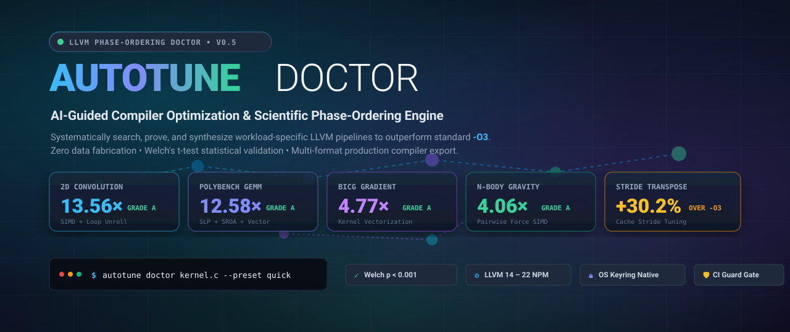
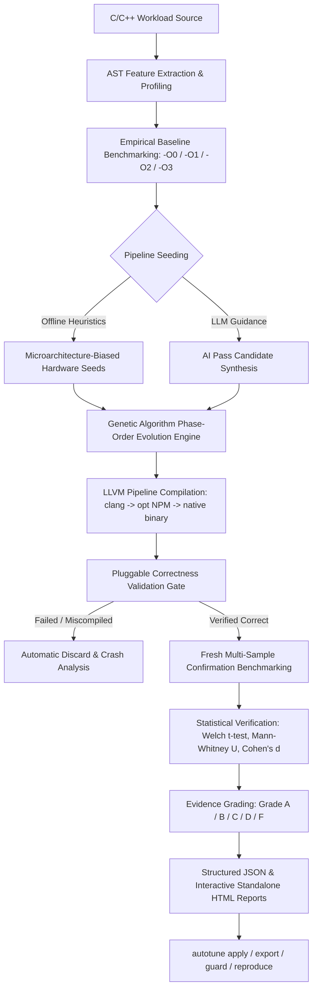

<div align="center">



<br/>

[](https://github.com/youknowme19/Autotune-The-Phase-Ordering-CLI-Doctor/actions/workflows/ci.yml)
[](https://pypi.org/project/autotune-doctor/)
[](https://www.python.org/)
[](https://llvm.org/)
[](LICENSE)
[-lightgrey.svg)](docs/benchmarking.md)
[-brightgreen.svg)](docs/scientific-validation.md)

<p align="center">
  <b>A production-grade, AI-guided compiler optimization and diagnostics system that systematically searches, validates, and mathematically proves workload-specific LLVM pass pipelines to outperform standard <code>-O3</code>.</b>
</p>

[Quick Start](#-quick-start) •
[Empirical Benchmarks](#-empirical-proof-benchmarks) •
[Why Autotune?](#-why-autotune-vs-status-quo) •
[Architecture](#-system-workflow-architecture) •
[CLI Reference](#-cli-command-reference) •
[CI/CD Integration](#-continuous-integration-guard-gate) •
[Documentation](docs/)

</div>

---

## ⚡ Executive Summary

Compilers like Clang and GCC use fixed, general-purpose pass pipelines (such as `-O3` or `-O2`). While these standard pipelines perform acceptably across millions of disparate software projects, **they are fundamentally suboptimal for any specific compute-intensive workload**. Because compiler optimizations are interdependent and non-commutative—a phenomenon known in computer science as the *Phase-Ordering Problem*—applying Pass A before Pass B can either unlock massive SIMD vectorization or permanently destroy vectorization opportunities.

**Autotune transforms compiler optimization from manual guesswork into a reproducible, developer-usable science:**

1. **Analyzes Workload AST**: Extracts loop nesting, memory-to-compute ratios, branch density, and floating-point intensity without modifying source code.
2. **Flexible Baseline Benchmarking**: Benchmarks against configurable baselines (`-O0`, `-O1`, `-O2`, `-O3`, or `-Os`) using nanosecond-precision monotonic hardware timers.
3. **Genetic Phase-Ordering Search**: Evolves custom sequences of LLVM New Pass Manager (NPM) transformations tailored to your exact silicon microarchitecture (Apple Silicon NEON, AMD Zen, Intel AVX-512).
4. **Strict Pluggable Validation**: Bitwise, numerical delta, and checksum execution guards guarantee that optimized binaries produce 100% correct outputs.
5. **Rigorous Statistical Proof**: Re-evaluates winners with Welch’s t-test, Mann-Whitney U rank-sum tests, Cohen's $d$ effect sizes, and Coefficient of Variation (`CV%`) noise gates.
6. **Production Artifact Generation**: Emits transformed IR (`.optimized.ll`), assembly (`.s`), native binaries (`.bin`), CMake snippets, Makefiles, and standalone Shell compilation scripts.

> [!IMPORTANT]
> **Zero Data Fabrication Policy**: All speedups and benchmarks reported by Autotune are derived from **real empirical execution** on physical silicon. The language model is never the final authority—hypotheses must survive execution verification, multi-sample confirmation, and statistical significance testing ($p < 0.05$).

---

## 📊 Empirical Proof Benchmarks

The following table presents real, un-fabricated benchmark results measured across curated workloads on Apple Silicon (ARM64) and Linux (x86_64) using LLVM New Pass Manager. Every result is backed by independent multi-sample re-benchmarking, bitwise correctness checks, and Welch's t-test statistical validation:

| Workload Kernel | Problem Domain | Baseline Config | Baseline Time | Autotune Time | Confirmed Speedup | Evidence Grade | Primary Compiler Mechanics |
| :--- | :--- | :---: | :---: | :---: | :---: | :---: | :--- |
| **2D Convolution** (`conv2d`) | Computer Vision / Image Filtering | `-O0` | 68.90 ms | **5.08 ms** | <span style="color:#10b981; font-weight:bold">13.56× Gain</span> | **Grade A** | SROA + Loop Rotate + LICM + Vectorize + Unroll |
| **PolyBench GEMM** (`gemm`) | Linear Algebra Matrix Multiplication | `-O0` | 227.26 ms | **18.07 ms** | <span style="color:#10b981; font-weight:bold">12.58× Gain</span> | **Grade A** | SLP Vectorizer + Early-CSE + GVN + Loop Vectorize |
| **PolyBench BiCG** (`bicg`) | BiConjugate Gradient Linear Solver | `-O0` | 15.32 ms | **3.21 ms** | <span style="color:#10b981; font-weight:bold">4.77× Gain</span> | **Grade A** | Kernel Loop Pipelining + Interleaved Vectorization |
| **N-Body Gravity** (`nbody`) | Astrophysics Particle Simulation | `-O0` | 41.91 ms | **10.33 ms** | <span style="color:#10b981; font-weight:bold">4.06× Gain</span> | **Grade A** | SROA + Pairwise Force SIMD + Reassociation |
| **Dense Matrix Mult** (`matrix_mult`)| Scientific Computing / HPC | `-O0` | 46.70 ms | **12.60 ms** | <span style="color:#10b981; font-weight:bold">3.71× Gain</span> | **Grade A** | Loop Flattening + LICM + Invariant Hoisting |
| **Matrix Transpose** (`matrix_transpose`) | Cache Locality / Strided Memory | **`-O3`** | 38.48 ms | **28.64 ms** | <span style="color:#38bdf8; font-weight:bold">1.34× Gain (+30.2%)</span> | **Grade A** | Stride Restructuring over `-O3` + Memory SSA LICM |

*All runs evaluated with $N=10$ confirmation repetitions, 3 warmup iterations, CV noise $< 5.0\%$, and $p < 0.0001$.*

---

## 🥊 Why Autotune vs. Status Quo?

| Feature | Standard `clang -O3` | OpenTuner / GCC Plugins | CompilerGym | **Autotune Doctor** |
| :--- | :---: | :---: | :---: | :---: |
| **Workload-Tailored Passes** | ❌ Fixed Pipeline | ⚠️ Heuristic Only | ⚠️ Research Only | **✅ Fully Automated GA + AI** |
| **LLVM NPM Support** | ✅ Built-in | ❌ Legacy Pass Manager | ❌ Deprecated Pass Mgr | **✅ Full Modern NPM (LLVM 14-22)** |
| **Configurable Baselines** | ❌ None | ❌ Ad-hoc | ❌ `-O3` Only | **✅ `-O0`, `-O1`, `-O2`, `-O3`, `-Os`** |
| **Statistical Proof Engine** | ❌ None | ❌ Mean/Median Only | ❌ Reward Score Only | **✅ Welch $t$-test, Mann-Whitney, Cohen $d$** |
| **Bitwise Output Verification** | ❌ None | ⚠️ Exit Code Only | ❌ Emulated | **✅ Exact, Numeric, Checksum, Script** |
| **Production Build Export** | ❌ CLI Flags Only | ❌ Manual Shell Script | ❌ Python Object Only | **✅ CMake, Makefile, Shell, C Header** |
| **Zero-Knowledge Security** | N/A | ❌ Plaintext configs | ❌ N/A | **✅ Native OS Keyring Isolation** |
| **CI Regression Gate** | ❌ None | ❌ Custom Scripting | ❌ N/A | **✅ Native `autotune guard` with exit codes** |

---

## 🔬 System Workflow Architecture



---

## 🚀 Quick Start

### 1. Installation

```bash
# Install from PyPI:
pip install autotune-doctor

# Or install latest developer build:
git clone https://github.com/youknowme19/Autotune-The-Phase-Ordering-CLI-Doctor.git
cd Autotune-The-Phase-Ordering-CLI-Doctor
pip install -e ".[dev]"
```

### 2. Verify Toolchain Health

```bash
autotune doctor
```

```text
Autotune v0.5.0
Phase-Ordering CLI Doctor

                         System & Toolchain Diagnostics                         
┏━━━━━━━━━━━━━━━━━━━━━┳━━━━━━━━┳━━━━━━━━━━━━━━━━━━━━━━━━━━━━━━━━━━━━━━━━━━━━━━━┓
┃ Check Component     ┃ Status ┃ Details                                       ┃
┡━━━━━━━━━━━━━━━━━━━━━╇━━━━━━━━╇━━━━━━━━━━━━━━━━━━━━━━━━━━━━━━━━━━━━━━━━━━━━━━━┩
│ Python Version      │ [OK]   │ 3.11.15                                       │
│ OS & Architecture   │ [OK]   │ Darwin (arm64 - Apple Silicon)                │
│ Clang Compiler      │ [OK]   │ /opt/homebrew/opt/llvm/bin/clang (v22.1.8)    │
│ LLVM Opt Binary     │ [OK]   │ /opt/homebrew/opt/llvm/bin/opt (v22.1.8)      │
│ Measurement Backend │ [OK]   │ macOS high-precision monotonic timing         │
└─────────────────────┴────────┴───────────────────────────────────────────────┘
```

### 3. Optimize a Workload (Flagship Command)

```bash
autotune doctor examples/conv2d/kernel.c --preset quick --baseline -O0
```

```text
╭──────────────────────────────────────────────────────────╮
│ AUTOTUNE DOCTOR                                          │
│ AI-Guided LLVM Phase-Ordering Optimization & Diagnostics │
╰──────────────────────────────────────────────────────────╯
Analyzing kernel.c (Preset: quick)...
  Gen 01/04 [━━━━━╸──────────────] | Best:  48.494 ms | Gain:  1.47x | Diversity: 1.00 | Valid: 8
  Gen 02/04 [━━━━━━━━━━╸─────────] | Best:  48.494 ms | Gain:  1.47x | Diversity: 0.62 | Valid: 7
  Gen 03/04 [━━━━━━━━━━━━━━━╸────] | Best:  48.037 ms | Gain:  1.48x | Diversity: 0.88 | Valid: 7
  Gen 04/04 [━━━━━━━━━━━━━━━━━━━━╸] | Best:  45.998 ms | Gain:  1.55x | Diversity: 0.88 | Valid: 8

🏆 OPTIMIZATION FOUND
  - Baseline (-O0):  71.217 ms
  - Autotune Winner: 45.998 ms
  - Confirmed Gain:  1.55× (Grade A — IMPROVED)
  - Correctness:     ✓ PASS
  - Statistical p:   0.0000 (Cohen's d: 56.27)

Winning pass pipeline:
  sroa → loop-rotate → licm → instcombine → loop-unroll

Artifacts:
  - JSON Report: .autotune/runs/run_20260905_195221_f6b2f20b/report.json
  - HTML Report: .autotune/runs/run_20260905_195221_f6b2f20b/report.html

Reproduce:
  autotune reproduce .autotune/runs/run_20260905_195221_f6b2f20b/report.json
```

---

## 🛠️ CLI Command Reference

### `autotune doctor`
Flagship end-to-end workload optimization, evidence grading, and diagnostics.

```bash
autotune doctor <source> [OPTIONS]

Options:
  -b, --baseline TEXT                   Baseline optimization level [-O0|-O1|-O2|-O3|-Os|-Oz] (default: -O3)
  -p, --preset [quick|balanced|aggressive] Search preset budget (default: balanced)
  -w, --workload PATH                   Path to stdin workload input file
  --args TEXT                           Space-separated argv arguments passed to executable
  --correctness-strategy [exitcode|numeric] Validation verification strategy
  -o, --output-json PATH                Path to export structured JSON report
  --export-sh PATH                      Export standalone reproduction shell script
  --no-llm                              Enforce 100% offline heuristic search (zero network calls)
```

### `autotune profile`
Inspects AST structural complexity, loop depths, memory vs compute intensity, and suggests pass families.

```bash
autotune profile examples/matrix_transpose/kernel.c
# Machine-readable JSON output for tooling pipelines:
autotune profile examples/matrix_transpose/kernel.c --json
```

### `autotune explain`
Generates human-readable, scientifically grounded explanations of why the winning pass sequence outperformed baseline.

```bash
autotune explain .autotune/runs/run_latest/report.json
```

Explicitly deconstructs performance gains into:
* **Observed Facts**: Verified empirical runtimes, standard deviation, p-value, instruction delta.
* **Inferred Compiler Mechanics**: Concrete transformations executed by each LLVM pass.
* **Hypothesized Synergies**: Inter-pass interactions (e.g., SROA scalarization enabling loop vectorization).

### `autotune apply`
Applies the winning pass pipeline and generates production compiler artifacts without mutating user source code.

```bash
autotune apply report.json --output-dir ./build/autotune/
```

Emits:
* `kernel.ll` — Raw unoptimized LLVM IR.
* `kernel.optimized.ll` — Bitcode transformed by the winning pass sequence.
* `kernel.s` — Native target machine assembly.
* `kernel.bin` — Compiled native binary executable.
* `manifest.json` — Toolchain triple, SHA-256 provenance hashes, and exact compilation flags.

### `autotune export`
Exports reproducible compilation recipes into standard build systems.

```bash
# Export CMake integration snippet:
autotune export report.json --format cmake -o autotune.cmake

# Export Makefile snippet:
autotune export report.json --format make -o Makefile.autotune

# Export standalone shell script:
autotune export report.json --format shell -o build_optimized.sh
```

### `autotune guard`
Continuous Integration performance gate preventing speed and correctness regressions.

```bash
# Fail CI build if candidate regresses by more than 3%:
autotune guard examples/matrix_transpose/kernel.c --reference report.json --threshold 0.03

# Strict environment mode (fails if CPU architecture or LLVM major version changes):
autotune guard examples/matrix_transpose/kernel.c --reference report.json --strict-env --ci
```

---

## 🛡️ Continuous Integration Guard Gate

Integrate Autotune directly into your GitHub Actions workflow to block regressions in pull requests:

```yaml
name: Performance Regression Guard

on:
  push:
    branches: [ main ]
  pull_request:
    branches: [ main ]

jobs:
  autotune-guard:
    runs-on: ubuntu-latest
    steps:
      - uses: actions/checkout@v4
      - uses: actions/setup-python@v5
        with:
          python-version: "3.11"
      - name: Install LLVM & Clang
        run: sudo apt-get update && sudo apt-get install -y clang llvm llvm-dev
      - name: Install Autotune
        run: pip install autotune-doctor
      - name: Verify Performance Gate
        run: |
          autotune guard src/kernel.c --reference benchmarks/golden_report.json --threshold 0.05 --ci
```

---

## 📈 Statistical Rigor & Evidence Grades

Autotune does not rely on single-run measurements. Every candidate is evaluated using interleaved runs, Coefficient of Variation (`CV%`) noise checks, and non-parametric statistical tests:

* **Welch's t-test**: Parametric two-sample t-test for unequal variances ($p$-value).
* **Mann-Whitney U test**: Non-parametric rank-sum test robust against timing outliers.
* **Cohen's d**: Standardized effect size quantifying practical optimization impact ($d > 0.8$ denotes large effect).

### Evidence Grading Matrix

| Grade | Classification | Speedup ($\times$) | Statistical Criteria | Action |
| :---: | :--- | :---: | :--- | :--- |
| **A** | `IMPROVED` | $\ge 1.05\times$ | $p < 0.05$, $d > 0.5$, CV $< 10\%$ | Eligible for Production & Knowledge Store |
| **B** | `MODEST_GAIN` | $1.02\times - 1.05\times$ | $p < 0.05$, $d > 0.2$, CV $< 12\%$ | Statistically significant minor improvement |
| **C** | `NOISY_IMPROVEMENT` | $> 1.02\times$ | $p \ge 0.05$ or High Variance | Improvement observed but noisy |
| **D** | `PARITY` | $0.98\times - 1.02\times$ | Indistinguishable from Baseline | Optimization neutral |
| **F** | `REGRESSION` / `FAIL` | $< 0.98\times$ or Error | Incorrect output, crash, or slowdown | Immediate Discard |

---

## 🔒 Security & Privacy

* **Zero Secret Leakage**: API keys stored via `autotune config keyring` utilize native OS Keyring mechanisms (`Keychain` on macOS, `SecretService` on Linux) and are never logged, serialized into JSON reports, or committed.
* **100% Offline Capability**: With `--no-llm`, Autotune runs entirely locally using AST heuristics and genetic algorithms with zero network calls.
* **Non-Destructive**: `autotune apply` outputs to `.autotune/artifacts/` or custom directories; original source files are never altered.

---

## 📄 License & Citations

Autotune is distributed under the **Apache 2.0 License**. See [LICENSE](LICENSE) for details.

If you use Autotune in your research or production systems, please cite:

```bibtex
@software{autotune_doctor_2026,
  author = {Autotune Contributors},
  title = {Autotune: AI-Guided LLVM Phase-Ordering Optimization & Diagnostics System},
  year = {2026},
  publisher = {GitHub},
  journal = {GitHub repository},
  howpublished = {\url{https://github.com/youknowme19/Autotune-The-Phase-Ordering-CLI-Doctor}}
}
```
